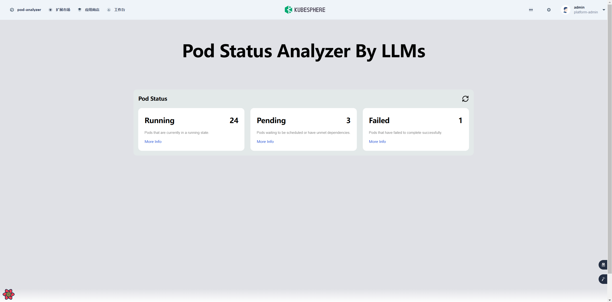
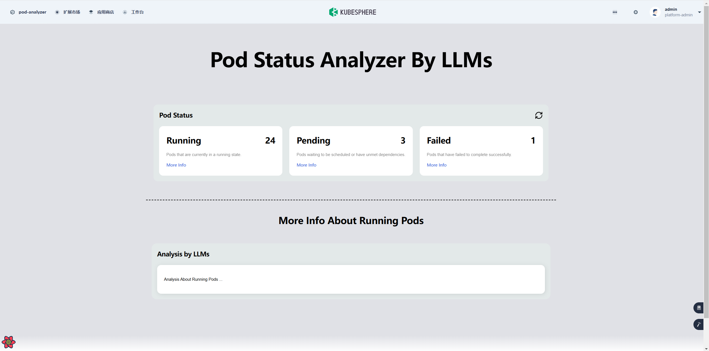
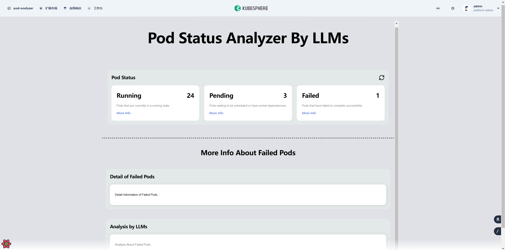
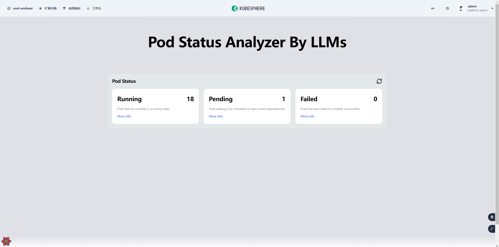
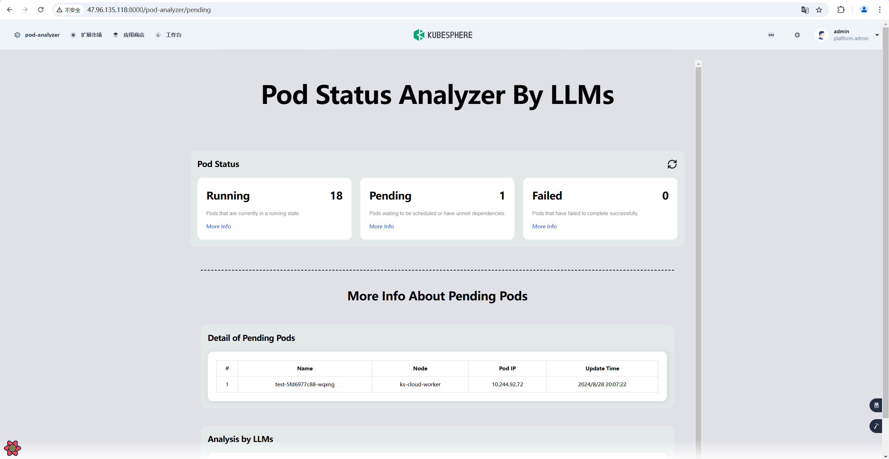

# **pod-analyzer**

With the widespread adoption of Kubernetes clusters, real-time monitoring and in-depth analysis of Pod statuses have become particularly important. As a comprehensive container management platform, KubeSphere needs to provide users with more intuitive and efficient tools to observe and analyze container statuses. Currently, KubeSphere lacks an integrated and user-friendly Pod status analysis tool, which limits users' deep understanding of cluster statuses and their ability to respond quickly.

This project plans to develop a lightweight analysis tool based on LangChain.js and Ollama to analyze Kubernetes Pod statuses and integrate it into KubeSphere's container status observation page, achieving seamless user experience and efficient Pod status analysis.

The initial PR, dated 0805, will be a basic static page, and the effect after deploying the KubeSphere plugin is as follows:

The second PR, submitted on 0828, primarily implements automatic retrieval of pod information through the KubeSphere API, specifically including:

- Main Page
  - Using useState and useEffect
    - Use useState to manage the state of podStatuses.
    - Use useEffect to call the API and fetch data when the component loads.
    
  - API Calls
    - Use fetch to get pod data from /api/v1/pods.
    - Calculate the number of different statuses based on the pod status.
    

  - Auto Refresh
    - Add a button to refresh the data by reloading the page with window.location.reload().

- Information Details Page
  - Interface Updates
    - Update the Pod interface to include nodeName, podIP, and updateTime.

  - API Data Handling
    - Get the node name from pod.spec.nodeName.
    - Get the pod IP address from pod.status.podIP.
    - Get the update time from pod.metadata.creationTimestamp.

the effect after deploying the KubeSphere plugin is as follows:

