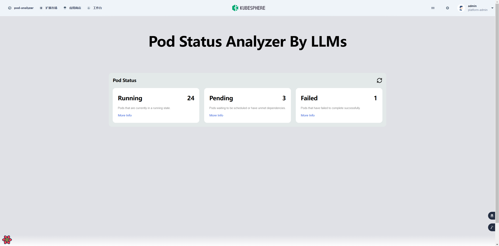
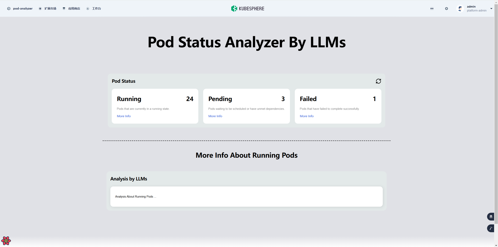
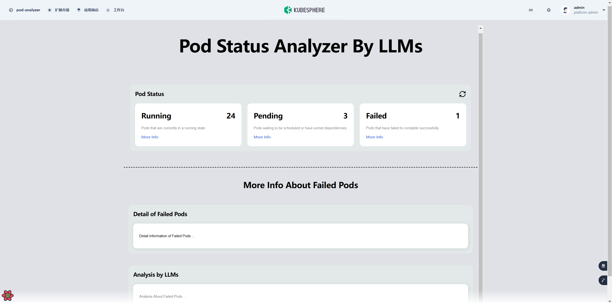

# **pod-analyzer**

With the widespread adoption of Kubernetes clusters, real-time monitoring and in-depth analysis of Pod statuses have become particularly important. As a comprehensive container management platform, KubeSphere needs to provide users with more intuitive and efficient tools to observe and analyze container statuses. Currently, KubeSphere lacks an integrated and user-friendly Pod status analysis tool, which limits users' deep understanding of cluster statuses and their ability to respond quickly.

This project plans to develop a lightweight analysis tool based on LangChain.js and Ollama to analyze Kubernetes Pod statuses and integrate it into KubeSphere's container status observation page, achieving seamless user experience and efficient Pod status analysis.

The initial PR will be a basic static page, and the effect after deploying the KubeSphere plugin is as follows:

