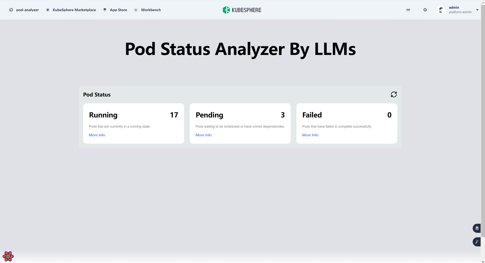
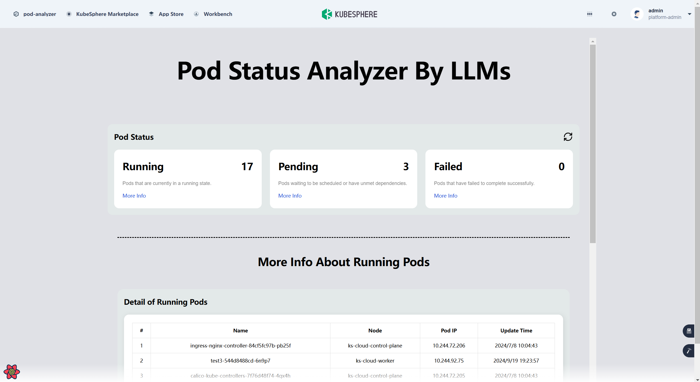
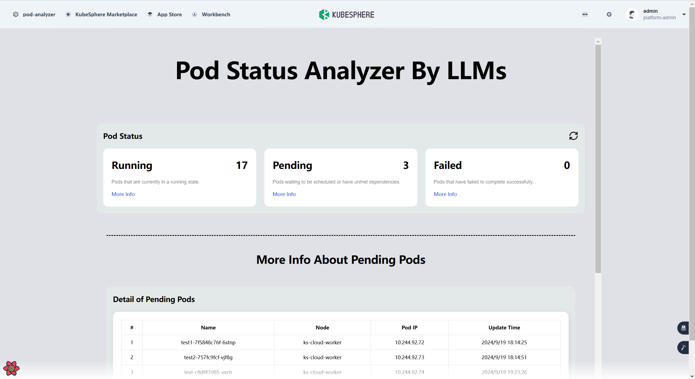
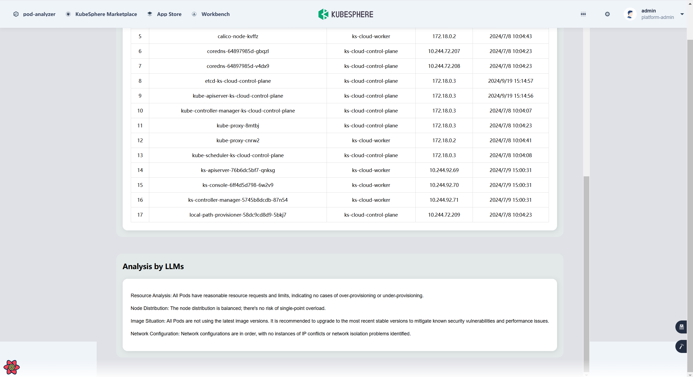
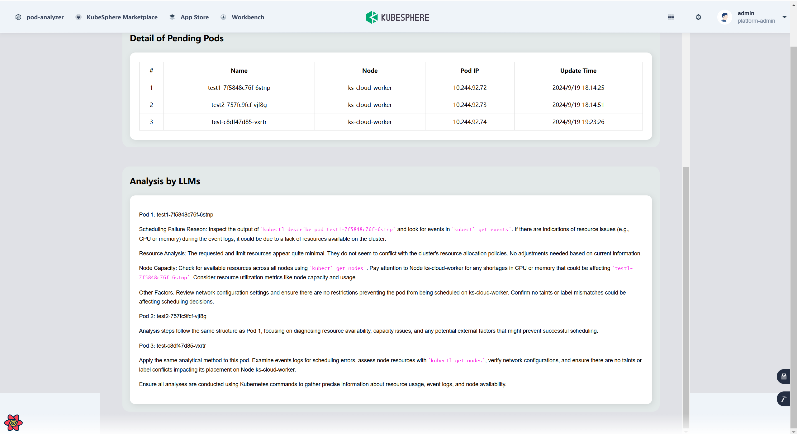
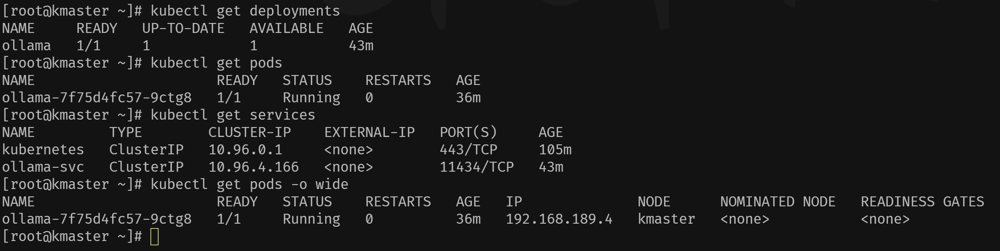

# *Pod Status Analysis Tool*

## 

## *Project Overview*

Welcome to the Pod Status Analysis Tool project! 

This project aims to develop a lightweight analysis extension component based on LangChain and Ollama, enabling seamless Pod status monitoring and analysis within KubeSphere cloud. 

## *Features*

- **Real-time Data Retrieval and Analysis**: real-time monitoring and data analysis of Pod status.
- **Seamless Integration**: Integrate the analysis tool into KubeSphere's existing observation pages for a consistent user experience.
- **Intuitive Frontend Interface**: Designed with React and LangChain for user-friendly interaction.

|        Running Status         |        Pending Status         |
| :---------------------------: | :---------------------------: |
|  |  |
|  |  |

## *Quick Start*

<span style="font-size:24px;">**Run the extension components locally**</span>

**Install the Kubesphere Extension Component Environment**

1. **Set Up a Kubernetes Cluster**

   - Set the `KKZONE` environment variable for China:

     ```bash
     export KKZONE=cn
     ```
   
   
      - Download and install `kk`:
   
        ```bash
        curl -sfL https://get-kk.kubesphere.io | sh -
        ```
   
   
      - Create a Kubernetes cluster with local storage and containerd:
   
        ```bash
        ./kk create cluster --with-local-storage --with-kubernetes v1.25.3 --container-manager containerd -y
        ```
   
   
      - Install Helm:
   
        ```bash
        curl https://raw.githubusercontent.com/helm/helm/main/scripts/get-helm-3 | bash
        ```
   
2. **Install the KubeSphere Luban Helm Chart**

   - Use Helm to install the KubeSphere Luban Helm Chart:

     ```bash
     helm upgrade --install -n kubesphere-system --create-namespace ks-core https://charts.kubesphere.io/main/ks-core-1.1.0.tgz --set apiserver.nodePort=30881 --debug --wait
     ```


3. **Install Tools Required for Extensions**

   - Install Node.js and Yarn:

     ```bash
     curl -fsSL https://deb.nodesource.com/setup_current.x | sudo -E bash -
     sudo apt-get install -y nodejs
     npm install --global yarn
     ```


**Set Up the Runtime Environment for LLM**

1. **Install Ollama**

   - Install `modelscope` and download the Ollama model:

     ```bash
     pip install modelscope
     modelscope download --model=modelscope/ollama-linux --local_dir ./ollama-linux --revision v0.3.10
     ```
   
   
      - Navigate to the directory and run the installation script:
   
        ```bash
        cd ollama-linux
        sudo chmod 777 ./ollama-modelscope-install.sh
        ./ollama-modelscope-install.sh
        ```
   


2. **Download the Qwen2:7b Model**

   - Pull the Qwen2:7b model using Ollama:

     ```bash
     ollama pull qwen2:7b
     ```


**Create and Deploy the Project**

1. **Initialize the Extension Component**

   - Create a directory for KubeSphere extensions and initialize a new project:

     ```bash
     mkdir -p ~/kubesphere-extensions
     cd ~/kubesphere-extensions
     yarn add global create-ks-project
     yarn create ks-project ks-console
     cd ks-console
     yarn create:ext
     ```
   
   
      - During the initialization, provide the following details:
   
        ```
        Extension Name: pod-analyzer
        Display Name: pod-analyzer
        Description: pod analyzer
        Author: demo
        Language: TypeScript
        Create extension [pod-analyzer]? Yes
        ```
   


2. **Clone the Repository and Update Files**
   - Clone the repository and replace files under `ks-console/extensions/pod-analyzer/src` with the necessary files from the repository.


3. **Install Project Dependencies**

   - Install the required dependencies:

     ```bash
     yarn add @langchain/community -W
     yarn add react-markdown -W
     ```


4. **Modify the Configuration File**
   - Update `ks-console/configs/config.yaml` according to your specific requirements.


5. **Run the Extension Component**

   - Start the development server:

     ```bash
     yarn dev
     ```
   
   
      - Open your browser and visit `http://localhost:8000` to view the extension component.
   

<span style="font-size:24px;">**Deploy the extension components to KubeSphere**</span>

**Preparation**

1. **Install Kubernetes**

   - Ensure your machine has a Kubernetes cluster installed and configured.
   - If not, refer to the [Kubernetes documentation](https://kubernetes.io/docs/setup/) for installation instructions.

2. **Install kubectl**

   - `kubectl` is the command-line tool for interacting with Kubernetes clusters.
   - Refer to the [kubectl installation guide](https://kubernetes.io/docs/tasks/tools/install-kubectl/) for instructions.

3. **Docker Image**

   - Ensure you have built and pushed the Ollama Docker image to your container registry (e.g., Docker Hub).

   ```bash
   docker pull ollama/ollama
   ```

4. **Run Docker Container**

   - Run the Ollama container using the following command:

   ```bash
   docker run -d \
   -v /home/user/ollama:/root/.ollama \
   -p 11434:11434 \
   --name ollama \
   ollama/ollama
   ```

**Deploy Ollama to Kubernetes**

1. **Create Deployment File**

   - Create a file named `ollama-deployment.yaml` and add the following content:

   ```yaml
   apiVersion: apps/v1
   kind: Deployment
   metadata:
     name: ollama
   spec:
     selector:
       matchLabels:
         app: ollama
     template:
       metadata:
         labels:
           app: ollama
       spec:
         containers:
         - name: ollama
           image: ollama/ollama:latest
           ports:
           - name: http
             containerPort: 11434
             protocol: TCP
       tolerations:
         - key: "node-role.kubernetes.io/master"
           operator: "Exists"
           effect: "NoSchedule"
   ---
   apiVersion: v1
   kind: Service
   metadata:
     name: ollama-svc
   spec:
     selector:
       app: ollama
     ports:
     - protocol: TCP
       port: 11434
       targetPort: 11434
   ```

2. **Apply Configuration**

   - Apply the configuration using the following command:

   ```bash
   kubectl apply -f ollama-deployment.yaml
   ```

3. **Check Deployment Status**

   - Check the deployment status with these commands:

   ```bash
   kubectl get deployments
   kubectl get pods
   kubectl get services
   kubectl get pods -o wide
   ```

   - Reference results:

   

4. **Execute Command**

   - Enter the Pod and execute the command:

   ```bash
   kubectl exec -it <pod-name> -- ollama pull qwen2:7b
   ```

   - Replace `<pod-name>` with the actual Pod name.

5. **Install jq **

   - Need to process JSON data, install `jq`:

   ```bash
   sudo yum install jq
   ```

6. **Test：Send API Request**

   - Use `curl` to send a request:

   ```bash
   curl -L 'http://<node-ip>:11434/api/generate' \
   -H 'Content-Type: application/json' \
   -d '{
     "model": "qwen2:7b",
     "prompt": "Introduce artificial intelligence",
     "format": "json",
     "stream": false
   }'
   ```

   - Replace `<node-ip>` with the actual node IP address.

**Deploy  pod-analyzer  extension component to KubeSphere**

1. **Initialize the Extension Component Package**

   - Use the `ksbuilder create` command to create a new extension component package (Helm Chart).
   - Enter the extension component's name, author information, etc.

   ```bash
   cd extensions
   ksbuilder create
   ```

2. **Directory Structure**

   - The directory structure of the created extension component package is as follows:

   ```
   ├── README.md
   ├── README_zh.md
   ├── charts
   │   ├── backend
   │   │   ├── Chart.yaml
   │   │   ├── templates
   │   │   │   ├── NOTES.txt
   │   │   │   ├── deployment.yaml
   │   │   │   ├── extensions.yaml
   │   │   │   ├── helps.tpl
   │   │   │   └── service.yaml
   │   │   └── values.yaml
   │   └── frontend
   │       ├── Chart.yaml
   │       ├── templates
   │       │   ├── NOTES.txt
   │       │   ├── deployment.yaml
   │       │   ├── extensions.yaml
   │       │   ├── helps.tpl
   │       │   └── service.yaml
   │       └── values.yaml
   ├── extension.yaml
   ├── permissions.yaml
   ├── static
   │   ├── favicon.svg
   │   └── screenshots
   │       └── screenshot.png
   └── values.yaml
   ```

3.  **Edit extension.yaml**

   - Define the metadata of the extension component, including name, version, display name, description, and category.

4. **Orchestrate the Extension Component**

   - Define the frontend and backend extensions in the `frontend` and `backend` subdirectories, respectively.
   - Follow Helm Chart orchestration standards.
   - Supported global parameters include `global.clusterInfo.name`, `global.clusterInfo.role`, `global.imageRegistry`.

5. **Define Permissions**

   - Edit the `permissions.yaml` file to define the resource permissions needed for installing the extension component.
   - Follow the principle of least privilege to avoid requesting unnecessary or sensitive permissions.

6. **Package the Extension Component**

   - Use the `ksbuilder package` command to package the orchestrated extension component into a compressed file.

   ```bash
   cd extensions
   ksbuilder package pod-analyzer
   ```

   - The packaged file is saved as `pod-analyzer-0.1.0.tgz`.

7. **Deployment Testing**

   - Use the `ksbuilder publish` command to push the extension component to the remote extension store.

   ```bash
   ksbuilder publish pod-analyzer-0.1.0.tgz
   ```

   - The publishing process includes creating the extension component and version, as well as the related ConfigMap.
   - Access the remote KubeSphere Console.
   - View and deploy the newly published extension component in the extension store.
   - Conduct deployment testing to ensure the extension component functions correctly.

## *Contact Us*

- For any questions or suggestions, please reach out via the issues page.

- Thank you for your interest and support in the Pod Status Analysis Tool project!
